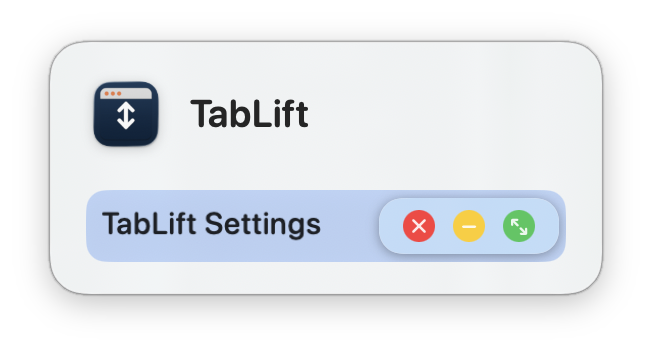

  <p align="center">
    
  </p>
  
  <p align="center">
    <a href="https://hackclub.com/hackatime/">
      
    </a>
    <a href="https://github.com/turtle-key/TabLift/blob/main/LICENSE">
      
    </a>
    <a href="https://github.com/turtle-key/TabLift/releases">
      
    </a>
    <a href="https://github.com/turtle-key/TabLift/releases">
      
    </a>
    <a href="https://github.com/turtle-key/TabLift/stargazers">
      
    </a>
  </p>
  <p align="center">
    
    
    
    
    
    
  </p>
  
  <p align="center">
    TabLift is a lightweight macOS utility that restores minimized apps instantly when switching with <code>⌘+Tab</code> or <code>⌘+`</code>.<br>
    By default, macOS ignores minimized windows unless you hold the <code>Option</code> key.<br>
    TabLift fixes this behavior, making app switching intuitive and seamless — no extra keys needed.
  </p>
  
  <p align="center">
    <a href="https://tablift.dev"><b>🌐 Visit the TabLift website</b></a>
  </p>
  
  ---

## Features

- **Instantly restores minimized windows** when you switch to an app using `⌘ + Tab` or ``⌘ + ` ``
- **Menu bar icon** with quick popover for access and control
- **One-click toggle** for restoring all minimized windows or just the last minimized window, from the menu bar or settings
- **Modern Settings & About window** with clickable version and license links
- **Sparkle-powered update checker**
- **Runs quietly in the background** with minimal resource usage
- **Compatible** with Mission Control, multiple desktops, and most macOS versions
- **Website** included in the repo, for documentation and SEO
- **Dock popups with live window previews:** Shows a beautiful popup when you hover Dock icons, including a diamond indicator for minimized windows.
<p align="center">
    
</p>
---

## How It Works

TabLift uses public Apple APIs to monitor when you activate a different app (via [`NSWorkspace`](https://developer.apple.com/documentation/appkit/nsworkspace) notifications).  
As soon as an app is activated, TabLift checks for minimized windows via the Accessibility API (`AXUIElement`).  
If a minimized window is found, it is instantly restored for you, either restoring all or just the most recently minimized window (configurable).

**Technical flow:**

1. **Listening:** `AppMonitor.swift` listens for app activation events.
2. **Restoring:** `WindowManager.swift` inspects the app's window list. If any window is minimized, it sets the `AXMinimized` attribute to `false`. The behavior (restore all or just the latest) is determined by a global toggle.
3. **Menu Bar:** `MenuBarManager.swift` provides a menu bar icon and popover with a quick settings toggle, open settings, and quit.
4. **Permissions:** On first launch, `PermissionsService.swift` prompts you to grant Accessibility permissions, which are required for window management.
5. **UI:** The `SettingsView.swift` (tabbed, includes About tab) provides quick links and info, including clickable version and license links, and toggles for behavior and launch at login.
6. **Updates:** The app checks for updates with Sparkle, customizable via the settings.
7. **Dock Popup:** `DockIconHoverMonitor.swift` and `DockPreviewPanel.swift` manage live Dock popups. These show all app windows, with a diamond icon for minimized windows. The feature can be enabled or disabled in Settings.
---
  
  ## Quick Start
  
  ### Option 1: Download Prebuilt App
  
  1. [Download the latest release](https://github.com/turtle-key/TabLift/releases/latest)
  2. Open the .dmg file and move the app into the /Applications folder
  3. Launch TabLift
  4. **Grant Accessibility permission** when prompted
  
  ### Option 2: Build from Source
  
  ```bash
  git clone https://github.com/turtle-key/TabLift.git
  cd TabLift
  open TabLift.xcodeproj
  ```
  Then build and run in Xcode.  
  You'll be prompted to grant Accessibility permission.
  
  ### Website
  
  The website sources are in the `website/` folder, powered by SvelteKit.  
  To run locally:
  
  ```bash
  cd website
  npm install
  npm run dev
  ```
  
  ---
  
  ## Permissions
  
  TabLift needs **Accessibility Access** to restore minimized windows.  
  You'll be prompted on first launch, or you can enable it manually:
  
  ```
  System Settings → Privacy & Security → Accessibility → Enable TabLift
  ```
  
  ---
  
  ## UI Preview
  
  <p align="center">
    
    
  </p>
  <p align="center">
  TabLift has a simple, modern Settings/About window with helpful links:
  </p>
  <p align="center">
    <a href="https://tablift.dev">Know more about TabLift</a> •
    <a href="https://coff.ee/turtle.key">Buy me a coffee</a> •
    <a href="https://github.com/turtle-key/TabLift">Source code on GitHub</a> •
    <a href="mailto:ghetumihaieduard@gmail.com">Email support</a>
  </p>
  
  ---
  
  ## File Structure

```
TabLift/
├── Sources/
│   ├── TabLiftApp.swift
│   ├── AppMonitor.swift
│   ├── WindowManager.swift
│   ├── MenuBarManager.swift
│   ├── DockIconHoverMonitor.swift   
│   ├── DockPreviewPanel.swift      
│   ├── SettingsView.swift
│   ├── AccessibilityPermissionWindow.swift
│   └── ... other Swift files
├── website/
│   ├── src/
│   ├── static/
│   └── ...
├── Images/
│   ├── banner.png
│   ├── banner-wbg.png
│   ├── tablift-shot-light.png
│   ├── tablift-shot-dark.png
│   └── ...
├── Assets.xcassets/
├── Info.plist
├── Sparkle/
└── TabLift.xcodeproj
```
  
  ---
  
  ## Tech Stack
  
  | Component            | Technology                                         |
  |----------------------|----------------------------------------------------|
  | macOS App Language   | Swift                                              |
  | macOS UI Frameworks  | SwiftUI (Settings/About window), AppKit (core)     |
  | macOS APIs Used      | Accessibility API (`AXUIElement`), NSWorkspace     |
  | Platform             | macOS 13.0 Ventura and later                       |
  | macOS Packaging      | `.app` bundle (no kernel extensions)               |
  | Website Framework    | SvelteKit (Svelte, TypeScript, Vite)               |
  | Website Styling      | CSS, HTML5                                         |
  | Website Hosting      | Static (exportable, deploy anywhere)               |
  | Other                | Open Graph, Twitter Cards, SEO meta, robots.txt    |
  
  ---
  
  ## Contributing
  
  Pull requests are welcome!  
  If you have suggestions, bug reports, or want to help improve TabLift:
  
  1. Fork the repo
  2. Create a feature branch:
     ```bash
     git checkout -b feature/your-feature-name
     ```
  3. Push and open a PR
  
  ---
  
  ## License
  
  **AGPL-3.0 License**  
  © Mihai-Eduard Ghețu – See [`LICENSE`](LICENSE) for details.
  
  ## Credits
  
  Built for macOS power users frustrated with Apple's default app switching.  
  Thanks to the accessibility community and everyone who contributed feedback(the voices in my head).
  
  ---
  
  > TabLift – *Lift your windows. Free your workflow.*
