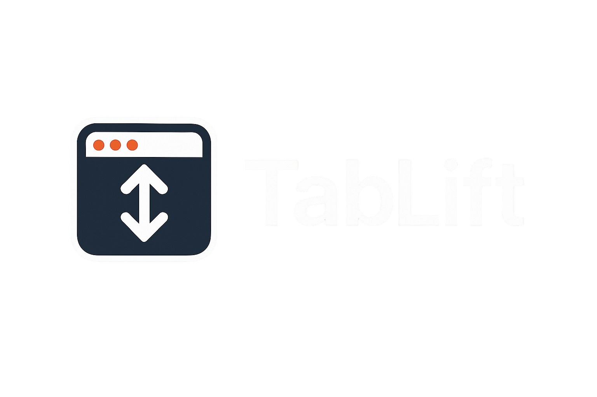

<p align="center">
  
</p>

<p align="center">
  <a href="https://hackclub.com/hackatime/">
    
  </a>
  <a href="https://github.com/turtle-key/TabLift/blob/main/LICENSE">
    
  </a>
  <a href="https://github.com/turtle-key/TabLift/releases">
    
  </a>
  <a href="https://github.com/turtle-key/TabLift/stargazers">
    
  </a>
</p>
<p align="center">
  
  
  
  
  
  
</p>

<p align="center">
  TabLift is a lightweight macOS utility that restores minimized apps instantly when switching with <code>⌘+Tab</code>.<br>
  By default, macOS ignores minimized windows unless you hold the <code>Option</code> key.<br>
  TabLift fixes this behavior, making app switching intuitive and seamless — no extra keys needed.
</p>

<p align="center">
  <a href="https://tablift.mihai.sh"><b>🌐 Visit the TabLift website → tablift.mihai.sh</b></a>
</p>

---

## Features

- **Instantly restores minimized windows** when you switch to an app using `⌘+Tab`
- No need to press extra keys — just switch!
- **Native macOS experience** (built with Swift, SwiftUI, and AppKit)
- **Runs quietly in the background** with minimal resource usage
- **Open source** and privacy-friendly  
- Compatible with Mission Control, multiple desktops, and most macOS versions
- **Modern About window** with clickable version and license links
- **Website** included in the repo, for documentation and SEO

## How It Works

TabLift uses public Apple APIs to monitor when you activate a different app (via [`NSWorkspace`](https://developer.apple.com/documentation/appkit/nsworkspace) notifications).  
As soon as an app is activated, TabLift checks for minimized windows via the Accessibility API (`AXUIElement`).  
If a minimized window is found, it is instantly restored for you.

**Technical flow:**

1. **Listening:** `AppMonitor` listens for app activation events.
2. **Restoring:** `WindowManager` inspects the app's window list. If any window is minimized, it sets the `AXMinimized` attribute to `false`.
3. **Permissions:** On first launch, `PermissionsService` prompts you to grant Accessibility permissions, which are required for window management.
4. **UI:** The About window (built in SwiftUI) provides quick links and info, including clickable version and license links.

## Quick Start

### Option 1: Download Prebuilt App

1. [Download the latest release](https://github.com/turtle-key/TabLift/releases/latest)
2. Open the .dmg file and move the app into the /Applications folder
3. Launch TabLift
4. **Grant Accessibility permission** when prompted

### Option 2: Build from Source

```bash
git clone https://github.com/turtle-key/TabLift.git
cd TabLift
open TabLift.xcodeproj
```
Then build and run in Xcode.  
You'll be prompted to grant Accessibility permission.

### Website

The website sources are in the `website/` folder, powered by SvelteKit.  
To run locally:

```bash
cd website
npm install
npm run dev
```

## Permissions

TabLift needs **Accessibility Access** to restore minimized windows.  
You'll be prompted on first launch, or you can enable it manually:

```
System Settings → Privacy & Security → Accessibility → Enable TabLift
```

## UI Preview

<p align="center">
  
</p>

<p align="center">
TabLift has a simple About window with helpful links:
</p>
<p align="center">
  <a href="https://tablift.mihai.sh">Know more about TabLift</a> •
  <a href="https://coff.ee/turtle.key">Buy me a coffee</a> •
  <a href="https://github.com/turtle-key/TabLift">Source code on GitHub</a> •
  <a href="mailto:ghetumihaieduard@gmail.com">Email support</a>
</p>

---

## File Structure

```
TabLift/
├── Sources/
│   ├── TabLiftApp.swift          // Main app entry point and delegate
│   ├── AppMonitor.swift          // Listens for app switch events
│   ├── WindowManager.swift       // Restores minimized windows
│   ├── PermissionsService.swift  // Handles Accessibility permissions
│   └── AboutView.swift           // SwiftUI About & links window
├── website/                      // SvelteKit-powered website
│   ├── src/
│   ├── static/
│   ├── package.json
│   └── ... (SvelteKit structure)
├── Images/
│   ├── banner.png
│   └── app-screenshot.png
├── Assets.xcassets/
├── Info.plist
└── TabLift.xcodeproj
```

## Tech Stack

| Component            | Technology                                         |
|----------------------|----------------------------------------------------|
| macOS App Language   | Swift                                              |
| macOS UI Frameworks  | SwiftUI (About window), AppKit (core behavior)     |
| macOS APIs Used      | Accessibility API (`AXUIElement`), NSWorkspace     |
| Platform             | macOS 12.0 Monterey and later                      |
| macOS Packaging      | `.app` bundle (no kernel extensions)               |
| Website Framework    | SvelteKit (Svelte, TypeScript, Vite)               |
| Website Styling      | CSS, HTML5                                         |
| Website Hosting      | Static (exportable, deploy anywhere)               |
| Other                | Open Graph, Twitter Cards, SEO meta, robots.txt    |

## Contributing

Pull requests are welcome!  
If you have suggestions, bug reports, or want to help improve TabLift:

1. Fork the repo
2. Create a feature branch:
   ```bash
   git checkout -b feature/your-feature-name
   ```
3. Push and open a PR

## License

**MIT License**  
© Mihai-Eduard Ghețu – See [`LICENSE`](LICENSE) for details.

## Credits

Built for macOS power users frustrated with Apple's default app switching.  
Thanks to the accessibility community and everyone who contributed feedback(my voices).

---

> TabLift – *Lift your windows. Free your workflow.*
